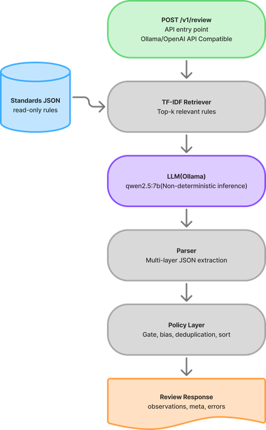

# Content Standards Review Service (CSRS)

Artificial Intelligence (AI)-powered Application Programming Interface (API) that reviews instructional content against standards rules and returns structured, User Interface (UI)-ready observations with traceable citations.

## Quick Start

```bash
# Install dependencies
uv sync --all-extras

# Start the service (requires Ollama running on port 11435)
CSR_MODEL_ID=gemma3:27b uv run uvicorn src.csr_service.main:app --port 9020

# Health check
curl http://localhost:9020/health

# List available standards
curl http://localhost:9020/v1/standards

# Submit a review
curl -X POST http://localhost:9020/v1/review \
  -H "Authorization: Bearer demo-token" \
  -H "Content-Type: application/json" \
  -d '{"content":"The student will understand basic navigation.","standards_set":"naval_v3","strictness":"medium"}'
```

## Configuration

All settings are configured via environment variables with `CSR_` prefix:

| Variable | Default | Description |
|----------|---------|-------------|
| `CSR_OLLAMA_BASE_URL` | `http://localhost:11435/v1` | Ollama OpenAI-compatible endpoint |
| `CSR_MODEL_ID` | `qwen2.5:7b-instruct` | Model to use for reviews |
| `CSR_MODEL_TIMEOUT` | `30.0` | Model request timeout (seconds) |
| `CSR_STANDARDS_DIR` | `standards` | Directory containing standards JavaScript Object Notation (JSON) files |
| `CSR_AUTH_TOKEN` | `demo-token` | Bearer token for API authentication |
| `CSR_MAX_CONTENT_LENGTH` | `50000` | Maximum content length (characters) |
| `CSR_POLICY_VERSION` | `1.0.0` | Policy version reported in responses |
| `CSR_PORT` | `9020` | Default server port |
| `CSR_SINGLE_RULE_MODE` | `false` | Evaluate one rule per request (parallel) |
| `CSR_SINGLE_RULE_PARALLEL` | `true` | Run single-rule evaluations in parallel |

## API Endpoints

### `GET /health`

Returns service status, loaded standards count, and model backend status.

### `GET /v1/standards`

Lists available standards sets with their IDs, names, and versions.

### `POST /v1/review`

Reviews content against a standards set. Requires `Authorization: Bearer <token>` header.

**Request:**
```json
{
  "content": "Instructional text to review...",
  "standards_set": "naval_v3",
  "strictness": "low|medium|high",
  "request_id": "optional-tracking-id",
  "options": {
    "return_rationale": true,
    "return_excerpts": true,
    "max_observations": 25,
    "min_confidence": 0.55
  }
}
```

**Response:**
```json
{
  "observations": [
    {
      "id": "7feefc4898aa",
      "span": [25, 44],
      "severity": "violation",
      "category": "pedagogy",
      "standard_ref": "NAV-TR-3.1.1",
      "message": "Uses vague verb 'understand'",
      "suggested_fix": "Replace with 'identify' or 'demonstrate'",
      "rationale": "Bloom's taxonomy requires measurable verbs",
      "standard_excerpt": "All learning objectives must use observable...",
      "confidence": 0.95
    }
  ],
  "meta": {
    "request_id": "abc123",
    "standards_set": "naval_v3",
    "strictness": "medium",
    "policy_version": "1.0.0",
    "model_id": "gemma3:27b",
    "latency_ms": 1823,
    "usage": {"input_tokens": 938, "output_tokens": 170}
  },
  "errors": []
}
```

See [docs/API.md](docs/API.md) for full Application Programming Interface (API) reference.

## How It Works



1. **Retrieval** - Term Frequency–Inverse Document Frequency (TF-IDF) vectorizes the input content and retrieves the top-k most relevant rules from the standards set (k varies by strictness: low=6, medium=10, high=14)

2. **LLM Analysis** - The content and retrieved rules are sent to the Large Language Model (LLM) with a structured prompt enforcing JSON output. The model identifies issues, locates them in the text via character spans, and assigns severity/confidence.

3. **Parsing** - Multi-layer JSON extraction handles non-ideal model outputs (direct parse, code-fence extraction, brace extraction). Invalid observations are discarded individually, allowing partial salvage of model output instead of full request failure.

4. **Policy** - Deterministic post-processing applies confidence gating, strictness-based severity bias, deduplication, sorting, and truncation.

## Project Structure

```
src/csr_service/
├── main.py              # FastAPI app, lifespan, Cross-Origin Resource Sharing (CORS) configuration
├── config.py            # Environment-based settings
├── auth.py              # Bearer token dependency
├── logging.py           # Structured logging with request_id
├── schemas/             # Pydantic request/response models
├── standards/           # Standards loader + TF-IDF retriever
├── engine/              # Prompt construction, model client, parser, pipeline
├── policy/              # Confidence gating, strictness bias, dedup, sort
└── routes/              # API endpoint handlers

standards/               # Standards rule definitions (JSON)
eval/                    # Evaluation harness + golden test cases
tests/                   # Unit and integration tests
```

## Standards Format

Standards sets are JSON files in the `standards/` directory:

```json
{
  "standards_set": "naval_v3",
  "name": "Naval Training Standards v3",
  "version": "3.0",
  "rules": [
    {
      "standard_ref": "NAV-TR-3.1.1",
      "title": "Learning objectives must be measurable",
      "body": "All learning objectives must use observable verbs...",
      "tags": ["objectives", "measurable"],
      "severity_default": "violation"
    }
  ]
}
```

To add a new standards set, drop a JSON file following this schema into the `standards/` directory and restart the service.

## Development

```bash
# Run tests
uv run pytest tests/ -v

# Lint and format
uv run ruff check . && uv run ruff format .

# Type checking
uv run mypy src/
```

## Evaluation Harness

Run the evaluation harness against a live service to measure schema compliance, observation repeatability, and latency:

```bash
# Start the service first, then:
uv run python -m eval.runner --cases eval/cases --backend ollama --base-url http://localhost:9020

# Options:
#   --cases DIR       Directory with test case JSON files
#   --backend NAME    Backend name (display only)
#   --base-url URL    Service URL (default: http://localhost:9020)
#   --token TOKEN     Auth token (default: demo-token)
#   -n N              Repeat count for stability check (default: 5)
```

## Error Handling

The service never breaks the response schema:

| Scenario | Behavior |
|----------|----------|
| Model unreachable | `observations=[], errors=[{code: "MODEL_FAILURE"}]` |
| Parse failure | Multi-layer extraction, partial salvage, `MODEL_PARSE_FAILURE` error |
| Invalid observation | Discarded individually (out-of-bounds spans, unknown refs) |
| Empty content | HTTP 422 `EMPTY_CONTENT` |
| Content too long | HTTP 422 `CONTENT_TOO_LONG` |
| Unknown standards set | HTTP 422 `STANDARDS_NOT_FOUND` |
| Missing/invalid auth | HTTP 401 `AUTH_FAILED` |

## Research & Experiments

This project uses hypothesis-driven development to systematically improve the AI pipeline. See:

- **[docs/RESEARCH_OVERVIEW.md](docs/RESEARCH_OVERVIEW.md)** — Full analysis of methodology, experiments, and findings
- **[eval/experiments/](eval/experiments/)** — Individual experiment documentation and results

### Key Findings

| Experiment | Hypothesis | Result |
|------------|-----------|--------|
| H1: Forced Traversal | Passive prompts cause under-detection | **Supported** — Per-rule evaluation fixed silent compliance |
| H2: Single-Rule Mode | Narrower scope improves accuracy | **Partial** — Better coverage, but over-detection |

### Current Status

The system successfully identifies standards violations but requires calibration:
- Prompt engineering significantly impacts detection (H1)
- Evaluation scope affects precision/recall tradeoff (H2)
- Severity classification needs improvement
- See [RESEARCH_OVERVIEW.md](docs/RESEARCH_OVERVIEW.md) for detailed recommendations

**Note**: This project is meant as a proof of concept demo and should not be used in production. All data is synthetic and for demonstration purposes only.